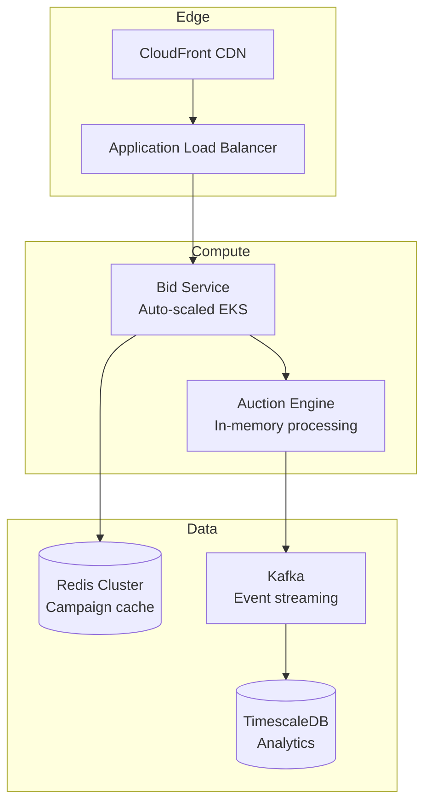

# Purpose

Assist with strategic system design decisions, analyzing trade-offs, defining architectures, and creating technical specifications for complex systems.

## When to Use

Use this skill when the task involves:

- Designing new system architecture from requirements
- Evaluating technology choices and trade-offs
- Planning system migrations or refactoring
- Creating technical specification documents
- Estimating infrastructure costs
- Analyzing scalability and reliability requirements

## Constraints

- Follow **Dependency Rule** — dependencies point inward to domain
- Keep **domain logic independent** of frameworks and infrastructure
- Treat **microservices as deployment strategy**, not architecture
- Apply **Domain-Driven Design** for complex business domains
- Document **explicit trade-offs** for every major decision
- Include **non-functional requirements** (latency, throughput, availability)

## Execution Steps

1. **Gather requirements** — Functional and non-functional (SLAs, scale targets)
2. **Identify domains** — Bounded contexts and their relationships
3. **Design components** — Services, databases, messaging, caching layers
4. **Create diagrams** — C4 model (context, container, component)
5. **Analyze trade-offs** — Document pros/cons of key decisions
6. **Estimate resources** — Team size, timeline, infrastructure costs
7. **Define milestones** — Phased delivery plan with risk mitigation

## Examples

### Input

> Design architecture for a real-time bidding platform handling 100k requests/second

### Output

````markdown
# Real-Time Bidding Platform Architecture

## Requirements

- **Throughput**: 100,000 requests/second peak
- **Latency**: P99 < 50ms for bid decisions
- **Availability**: 99.95% SLA

## High-Level Architecture


````

## Key Decisions

| Decision  | Choice        | Trade-off                               |
| --------- | ------------- | --------------------------------------- |
| Caching   | Redis Cluster | +Low latency, -Eventual consistency     |
| Database  | TimescaleDB   | +Time-series optimized, -Less ecosystem |
| Messaging | Kafka         | +Durability, -Operational complexity    |

## Cost Estimate (Monthly)

- EKS (50 nodes): ~$15,000
- Redis Cluster: ~$3,000
- Kafka (MSK): ~$2,500
- Data transfer: ~$5,000
- **Total**: ~$25,500/month

```

## Related Skills

- `terraform-aws-builder` — Implement infrastructure
- `database-schema-designer` — Design data models
- `kafka-stream-designer` — Event streaming design
```
